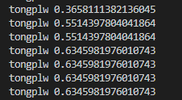

# Simple Keystroke Biometric

I developed this keystroke biometric project for Computer Security course. The biometric can return confidence value of whether who is the typer. 

## Getting Started

```sh
# 1. install dependencies
pip install -r ./requirements.txt

# 2. record user typing indentity and type sentences or paragraphs
python ./record.py

# 3. generate templates from those recored identities
python ./analyse.py

# 4. test typing and predict who is the typer
python ./test.py
```

## Prediction result

For every character typed, there will be value(s) of confidence showing up as the picture below

